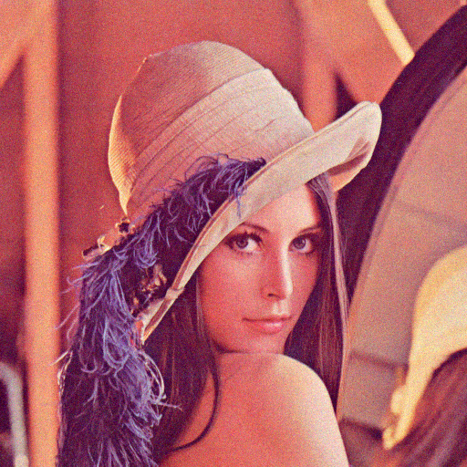
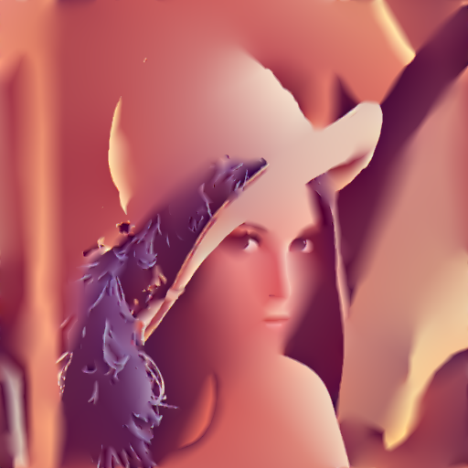

# Adaptive and Learning-Guided Extensions of Semi-Sparsity for Image Smoothing

## Overview

This repository extends the base semi-sparsity framework for edge-preserving image smoothing with three targeted extensions: **adaptive spatially varying thresholds**, **learning-guided semi-sparsity (LGSS)** using edge priors, and **multi-scale decomposition** analysis.

### Background: Edge-Preserving Image Smoothing

Edge-preserving smoothing is a fundamental image processing task that reduces noise and small variations while maintaining salient structural edges. The semi-sparsity approach extends classical L₀ gradient minimization by enforcing sparsity on **second-order gradients** (curvature), enabling piecewise-linear approximations that smooth flat regions and linear gradients while preserving transitions.

### Key Limitation

The original semi-sparsity formulation uses a **global threshold β** applied uniformly across the entire image. This uniform thresholding cannot adapt to local image content, leading to:
- Over-smoothing in textured regions
- Under-smoothing in homogeneous areas
- Parameter sensitivity across different image types

### 🚀 Main Contribution: Adaptive Semi-Sparsity

**Adaptive Semi-Sparsity (Primary Contribution)**  
Introduces spatially varying threshold β(x,y) modulated by local first-order gradient magnitude. This approach directly addresses the global threshold limitation, achieving **+4.45 dB improvement** on natural images (Lena) and the highest PSNR in 3 out of 4 test cases.

**LGSS (Secondary Contribution)**  
Incorporates external edge priors from Canny edge detection. Achieves competitive performance on natural images but does not surpass the adaptive method, indicating that externally derived edge priors provide limited complementary information beyond gradient-based internal weighting. Degrades on synthetic images (Strip: -2.24 dB).

**Multi-scale (Negative Result)**  
Explores coarse-to-fine strategy but demonstrates fundamental incompatibility with FFT-based global optimization. Results in severe performance degradation (35–40 dB vs 47 dB on Strip), highlighting fundamental incompatibility with FFT-based global optimization, providing valuable insight that not all extensions are compatible with the underlying optimization framework.

---

### Why This Work Matters

- **Spatial adaptivity outperforms external priors**: Demonstrates that locally modulating regularization strength is more effective than incorporating learned edge information for this optimization framework
- **Negative results are informative**: The multi-scale failure provides concrete evidence that FFT-based global optimization cannot naturally extend to multi-resolution schemes
- **Dual insights**: This work offers both a successful positive extension (adaptive) and a documented failure mode (multi-scale), guiding future research toward compatible algorithmic modifications

Overall, this work demonstrates that improving local regularization adaptivity is more effective than introducing additional priors within the semi-sparsity framework.

---

## Method Overview

### Energy Functional

The semi-sparsity energy combines three terms:

$$E(S) = \underbrace{\|S - I\|^2}_{\text{Data fidelity}} + \underbrace{\alpha\|\nabla S\|^2}_{\text{First-order smoothness}} + \underbrace{\lambda\|\nabla^2 S\|_0}_{\text{Second-order sparsity}}$$

Where:
- $\|\nabla^2 S\|_0$ counts non-zero second-order gradients (curvature)
- $\alpha$ controls baseline smoothness
- $\lambda$ controls sparsity penalty

### Optimization: Half-Quadratic Splitting (HQS)

The non-convex L₀ term is handled via HQS, alternating between:
1. **S-subproblem**: FFT-based quadratic minimization
2. **g-subproblem**: Hard thresholding: $g = \nabla^2 S$ if $\|\nabla^2 S\|^2 \geq \beta/\lambda$

### Adaptive Threshold Idea

Instead of a uniform threshold β, we use spatially adaptive β(x,y):

$$\beta(x,y) = \beta_0 \cdot w(x,y)^\eta$$

where $w(x,y) = \exp(-\gamma \sqrt{\nabla_x S^2 + \nabla_y S^2})$

- At edges (large gradient): β → 0, preserving edge sharpness
- In smooth regions: β ≈ β₀, enforcing stronger smoothing

### LGSS Weight Map

LGSS incorporates external edge probability maps E(x,y):
- Weight map: $W(x,y) = 1 - E(x,y)$
- Threshold: $\text{threshold}(x,y) = \frac{\beta \cdot W(x,y)}{\lambda}$
- Edge detection: Canny with Gaussian smoothing (σ=3)

---

## Repository Structure

```
.
├── run_semi_sparsity.m              # Base semi-sparsity implementation
├── run_semi_sparsity_adaptive.m     # Adaptive threshold extension
├── run_learning_guided.m            # LGSS implementation
├── run_multi_scale_semi.m           # Multi-scale extension (fails)
├── semi_sparsity_core.m             # Core HQS solver
├── semi_sparsity_lgss.m             # LGSS core function
├── run_l0_gradient.m                # L₀ gradient baseline
├── run_abstraction.m                # Image abstraction application
├── compare_l0_vs_semi.m             # Visual comparison script
├── verify_semi_sparsity.m           # Statistical sparsity verification
├── test_hq_sp.m                     # Demo-level implementation
├── run_dual_order.m                 # Dual-order implementation
├── generate_edge_map.py             # Edge map generation (OpenCV)
│
├── lena.png, lena_noisy.png         # Test images
├── Cameraman.jpg, Cameraman_noisy.png
├── Barbara.jpg, Barbara_noisy.png
├── strip_gt.png, strip_noise.png
│
├── edges/                           # Pre-generated edge maps
│   ├── edge_map_Lena.png
│   ├── edge_map_Cameraman.png
│   ├── edge_map_Barbara.png
│   └── edge_map_strip_noise.png
│
├── output/                          # Result images and comparisons
│   ├── *_semi_sparsity_res.png      # Base method results
│   ├── *_semi_sparsity_adaptive_res.png  # Adaptive results
│   ├── *_semi_sparsity_noise.png    # Noisy inputs
│   ├── *_semi_sparsity_gt.png       # Ground truth
│   └── ...
│
├── output(demo_implementation)/     # Demo outputs
├── research_paper.tex               # Full research paper (LaTeX)
├── Adaptive_and_Learning_Guided_Extensions_of_Semi_Sparsity_for_Image_Smoothing.pdf
└── README.md                        # This file
```

---

## Results

### PSNR Comparison (dB)

| Image     | Original | Adaptive | LGSS   | Best Improvement |
|-----------|----------|----------|--------|-------------------|
| Lena      | 24.87    | **29.32**| 28.88  | +4.45 dB          |
| Cameraman | 26.05    | **27.62**| 27.44  | +1.58 dB          |
| Barbara   | 26.30    | 26.15    | 26.17  | -0.14 dB          |
| Strip     | 46.99    | **47.01**| 44.76  | +0.02 dB          |

### Key Observations

The adaptive method emerges as the dominant improvement, achieving highest PSNR in three of four test cases with a substantial +4.45 dB gain on Lena. LGSS provides competitive results on natural images but cannot surpass adaptive performance, indicating that externally derived edge priors offer limited additional information beyond the gradient-based internal weighting. The multi-scale approach fails catastrophically, underscoring its fundamental incompatibility with FFT-based global optimization. The Barbara image exposes a critical limitation: second-order sparsity cannot reliably distinguish between structured texture and noise, resulting in performance degradation across all methods.

---

## Failure Analysis

### Why Multi-Scale Fails

The multi-scale extension fundamentally conflicts with the global FFT-based optimization:

1. **Global optimization structure**: FFT-based solver uses periodic boundary conditions. Downsampling destroys the relationship between Fourier coefficients at different scales.

2. **Initialization bias**: The HQS continuation strategy starts with nearly quadratic (small λ) and gradually increases sparsity. Initializing with a smoothed coarse estimate biases optimization toward intermediate sparsity.

3. **Aliasing artifacts**: Downsampling without proper anti-aliasing introduces high-frequency artifacts during optimization.

This negative result demonstrates that **not all algorithmic extensions are compatible with the underlying optimization framework**.

### Texture Limitation

All methods struggle with texture-rich images (e.g., Barbara). Second-order sparsity cannot distinguish between semantic texture patterns and noise—both have high curvature. Future work requires texture-aware models or higher-level priors. Notably, the adaptive method also exhibits limitations in texture-rich regions, where second-order sparsity fails to distinguish structured texture from noise, leading to slight performance degradation.

---

## Usage Instructions

### Requirements
- **MATLAB** (tested on R2020+)
- **Python 3** + **OpenCV** (for edge map generation in LGSS)

### Running the Methods

**1. Base Semi-Sparsity**
```matlab
run_semi_sparsity
```
Generates: `output/*_semi_sparsity_res.png`

**2. Adaptive Semi-Sparsity** (recommended)
```matlab
run_semi_sparsity_adaptive
```
Generates: `output/*_semi_sparsity_adaptive_res.png`

**3. Learning-Guided Semi-Sparsity (LGSS)**

First generate edge maps (if not exists):
```bash
python generate_edge_map.py
```

Then run:
```matlab
run_learning_guided
```

**4. Multi-Scale (not recommended - fails)**
```matlab
run_multi_scale_semi
```

**5. L₀ Gradient Baseline**
```matlab
run_l0_gradient
```

**6. Image Abstraction Application**
```matlab
run_abstraction
```

### Parameters

Default parameters (defined in core functions):
- α = 0.1 (first-order weight)
- β = 0.02 (sparsity threshold)
- λ₀ = 10β, λ_max = 10⁸
- κ = 1.2, τ = 0.95 (continuation)
- Adaptive: γ = 10, η = 2
- LGSS: Canny thresholds (40, 120), Gaussian σ = 3

---

## Visual Results

### Lena Denoising Comparison

| Noisy Input | Original Semi-Sparsity | Adaptive (Ours) |
|-------------|------------------------|-----------------|
|  |  |  |

### Additional Results

- **Cameraman**: [Noisy](output/cameraman_semi_sparsity_noise.png) | [Original](output/cameraman_semi_sparsity_res.png) | [Adaptive](output/cameraman_semi_sparsity_adaptive_res.png)
- **Barbara**: [Noisy](output/barbara_semi_sparsity_noise.png) | [Original](output/barbara_semi_sparsity_res.png) | [Adaptive](output/barbara_semi_sparsity_adaptive_res.png)
- **Strip**: [Noisy](output/strip_semi_sparsity_noise.png) | [Original](output/strip_semi_sparsity_res.png) | [Adaptive](output/strip_semi_sparsity_adaptive_res.png)

### Edge Maps (for LGSS)

- [Lena Edge Map](edges/edge_map_Lena.png)
- [Cameraman Edge Map](edges/edge_map_Cameraman.png)
- [Barbara Edge Map](edges/edge_map_Barbara.png)

The adaptive method visibly preserves fine structures (e.g., Lena's facial features, hat texture) while suppressing noise more effectively than the original semi-sparsity approach.

---

## Future Work

Based on the analysis in our paper, promising directions include:

1. **Learned edge priors**: Replace Canny with learned detectors (HED, RCF) trained on noisy images
2. **Joint optimization**: Iteratively estimate edges and smooth jointly
3. **Texture-aware smoothing**: Add LBP or Gabor features to distinguish texture from noise
4. **Deep learning integration**: CNNs to output spatially varying parameter maps
5. **Alternative optimization**: Primal-dual or ADMM methods enabling multi-resolution extensions
6. **Color image processing**: LAB/YUV spaces with inter-channel correlation

---

## References

- Q. Xin, Z. Liu, X. Wang, "Semi-Sparsity for Smoothing Filters," arXiv:2107.00627, 2021
- L. Xu, C. Lu, Y. Xu, J. Jia, "Image smoothing via L₀ gradient minimization," ACM TOG, 2011
- L. Rudin, S. Osher, E. Fatemi, "Nonlinear total variation based noise removal," Physica D, 1992

---

## License

This project is released under the **MIT License**. See the 'LICENSE' file for details.
